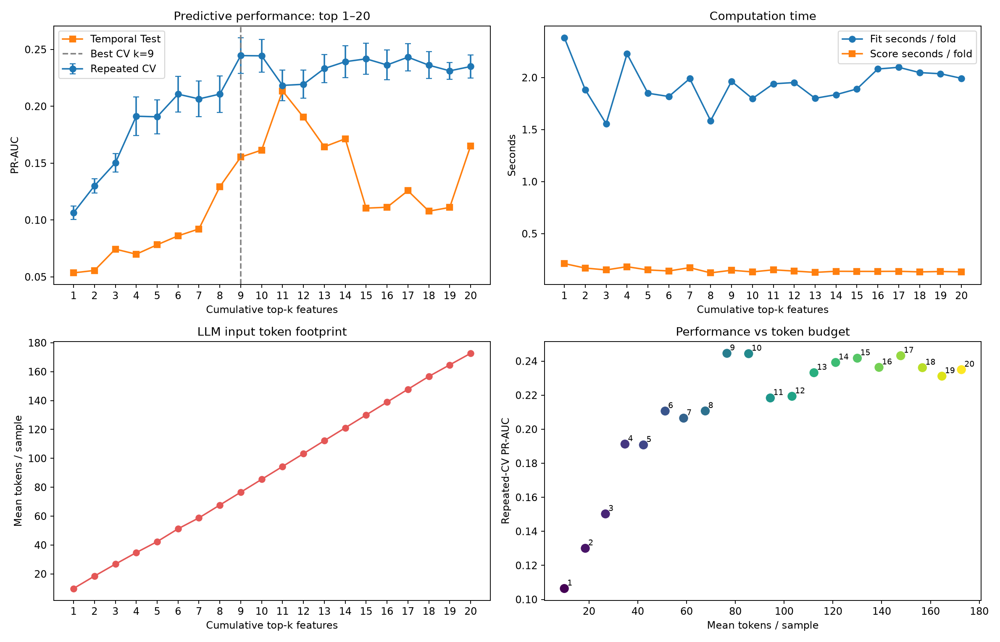

# SECOM 반도체 수율 Fail 분석 프로젝트 및 Feature Optimum 상세 보고서

## 1. 보고서 목적

본 문서는 UCI SECOM 반도체 공정 데이터로 수행한 Step 1~7 분석을 하나의 흐름으로 정리하고, 특히 상위 feature 누적 실험에서 도출된 **optimum feature 수**를 상세히 설명한다.

핵심 질문은 다음과 같다.

> 수율 Fail 예측 성능을 유지하면서 모델 연산량과 LLM 입력 토큰량을 줄일 수 있는 feature 조합은 무엇인가?

이 질문에 답하기 위해 다음 세 가지를 함께 평가했다.

1. 불균형 분류 성능: 반복 교차검증 PR-AUC와 시간순 Test PR-AUC
2. 계산 비용: fold별 평균 학습시간, 평가시간, 샘플당 추론시간
3. 입력 비용: 선택 feature를 JSON으로 전달할 때의 토큰 수

---

## 2. 프로젝트 개요

### 2.1 데이터

| 항목 | 값 |
|---|---:|
| 전체 샘플 | 1,567 |
| 원본 feature | 590 |
| Pass | 1,463 |
| Fail | 104 |
| Fail 비율 | 6.64% |
| 분석 기간 | 2008-07-19 ~ 2008-10-17 |

Fail 비율이 6.64%이므로 모든 샘플을 Pass로 예측해도 Accuracy는 약 93.36%다. 따라서 모델 평가는 Accuracy보다 Fail Recall, Precision, PR-AUC, Balanced Accuracy, False Negative와 False Positive를 중심으로 수행했다.

### 2.2 전체 분석 흐름

| 단계 | 핵심 내용 | 주요 결과 |
|---|---|---|
| Step 1 | 데이터 품질 진단 | 결측률 50% 이상 및 상수 feature를 반영해 446개 분석 대상 선정 |
| Step 2 | Pass/Fail EDA 및 통계 검정 | FDR 5% 기준 유의 후보 20개 |
| Step 3 | Baseline 모델 비교 | Balanced Random Forest 선택, threshold trade-off 확인 |
| Step 4 | 모델·통계 근거 교차검증 | `feature_59`, `feature_129`, `feature_125`가 4개 근거 모두 상위 |
| Step 5 | 시간순 검증 | Random split보다 Temporal Test 성능이 낮아 drift 위험 확인 |
| Step 6 | 상위 10개 누적 효율 실험 | 9개 feature가 최고 CV PR-AUC 및 One-SE optimum |
| Step 7 | 상위 20개 확장 검증 | 9개 optimum 유지, 9개 이후 성능 포화·비선형 확인 |

---

## 3. 데이터 품질과 feature 선정 배경

원본 590개 feature를 그대로 모델에 투입하지 않고 다음 기준으로 먼저 진단했다.

| 진단 항목 | 결과 |
|---|---:|
| 일부 결측값이 있는 feature | 538 |
| 결측률 50% 이상 feature | 28 |
| 상수 feature | 116 |
| 제거 후보 반영 후 분석 feature | 446 |

결측률이 매우 높은 feature는 실제 운영에서 측정 가용성이 낮을 수 있고, 상수 feature는 Pass/Fail 구분에 기여할 수 없다. 두 조건의 합집합을 제외한 446개를 후속 분석 대상으로 사용했다.

모델 전처리는 Pipeline 내부에서 수행했다.

- 결측값: Train 데이터의 중앙값으로 대체
- Logistic Regression: 중앙값 대체 후 표준화
- Random Forest 및 Boosting: 중앙값 대체 후 모델 적합
- Test 데이터 정보는 전처리 학습에 사용하지 않음

---

## 4. 모델링과 운영 threshold 결과

반복 교차검증에서 비교한 모델은 Dummy prior, Balanced Logistic Regression, Balanced Random Forest, Balanced HistGradientBoosting이다.

| 모델 | Train CV PR-AUC | Test PR-AUC |
|---|---:|---:|
| Random Forest (balanced) | 0.198 | 0.200 |
| HistGradientBoosting (balanced) | 0.168 | 0.182 |
| Logistic Regression (balanced) | 0.163 | 0.118 |
| Dummy prior | 0.066 | 0.067 |

Random Forest는 Train CV PR-AUC가 가장 높았지만 기본 threshold 0.5에서는 Fail을 검출하지 못했다. Train out-of-fold 확률로 Recall 80% 이상 조건을 만족하는 threshold를 탐색한 결과 0.06이 선택됐다.

### Stratified Test 결과

| 지표 | 결과 |
|---|---:|
| Threshold | 0.06 |
| Fail Recall | 85.71% |
| Precision | 10.29% |
| PR-AUC | 0.200 |
| False Negative | 3 |
| False Positive | 157 |

이 결과는 높은 Recall이 자동 판정 가능성을 의미하지 않음을 보여준다. Fail 21건 중 18건을 찾았지만 Pass 157건을 경보로 분류했으므로, 모델은 단독 판정보다 후속 확인 검사를 위한 스크리닝 도구에 가깝다.

### Temporal Test 결과

시간순 앞 80%를 Train, 뒤 20%를 Test로 분리했을 때 PR-AUC는 0.097로 낮아졌다.

| 평가 방식 | Threshold | Recall | Precision | False Negative | False Positive |
|---|---:|---:|---:|---:|---:|
| Temporal validation에서 선택 | 0.04 | 94.12% | 5.78% | 1 | 261 |
| Step 3 threshold 고정 | 0.06 | 64.71% | 6.40% | 6 | 161 |

시간에 따라 Fail 비율과 feature 분포가 변하므로 random split 결과만으로 운영 성능을 판단하면 과대평가할 수 있다.

---

## 5. 상위 feature 순위

상위 순위는 Step 4 통합 근거표의 정렬 순서를 사용했다.

1. Random Forest impurity importance
2. Test PR-AUC 기반 permutation importance
3. Pass/Fail 표준화 평균 차이
4. Mann-Whitney U test 및 FDR 보정 결과

정렬 우선순위는 `evidence_count → permutation importance → impurity importance`다.

| 순위 | Feature | 순위 | Feature |
|---:|---|---:|---|
| 1 | `feature_59` | 11 | `feature_510` |
| 2 | `feature_129` | 12 | `feature_103` |
| 3 | `feature_125` | 13 | `feature_21` |
| 4 | `feature_205` | 14 | `feature_341` |
| 5 | `feature_519` | 15 | `feature_65` |
| 6 | `feature_477` | 16 | `feature_64` |
| 7 | `feature_247` | 17 | `feature_577` |
| 8 | `feature_130` | 18 | `feature_316` |
| 9 | `feature_33` | 19 | `feature_180` |
| 10 | `feature_452` | 20 | `feature_124` |

이 순위는 물리적 공정 중요도 순위가 아니다. SECOM feature가 비식별화되어 있으므로 실제 장비, 공정 step, 소재 또는 계측 항목과 연결하려면 별도의 공정 엔지니어 검증이 필요하다.

---

## 6. Feature budget 실험 설계

### 6.1 누적 조합

순위 1위만 사용하는 모델부터 1~20위 전체를 사용하는 모델까지 누적 조합을 구성했다.

```text
k=1  : feature_59
k=2  : feature_59 + feature_129
k=3  : feature_59 + feature_129 + feature_125
...
k=20 : 상위 20개 전체
```

각 조합에서 동일한 Balanced Random Forest와 중앙값 결측 대체 Pipeline을 사용했다.

### 6.2 성능 측정

- 5-fold × 3회 Repeated Stratified Cross-Validation
- 총 15개 fold의 PR-AUC 평균·표준편차·표준오차 계산
- 시간순 마지막 20% 구간의 Temporal Test PR-AUC 추가 계산
- Random Forest 설정과 random state 고정

PR-AUC를 주 지표로 사용한 이유는 Fail 비율이 낮아 ROC-AUC나 Accuracy보다 실제 양성 탐지 품질을 더 직접적으로 보여주기 때문이다.

### 6.3 시간 측정

- `fit_time_mean_seconds`: fold당 평균 Pipeline 학습시간
- `score_time_mean_seconds`: fold당 평균 평가시간
- `inference_time_ms_per_sample`: 시간순 Test에서 샘플당 `predict_proba` 시간

시간은 실행 환경, CPU 상태, 캐시, tree 구조에 영향을 받는다. 특히 1~10개와 11~20개는 별도 실행 세션에서 측정됐으므로 절대적인 미세 차이보다 규모와 선형성 여부를 중심으로 해석한다.

### 6.4 토큰 측정

Random Forest 자체는 LLM 토큰을 소비하지 않는다. 본 프로젝트의 토큰량은 선택 feature를 LLM 기반 분석기로 전달하는 상황을 가정한 **입력 footprint**다.

- 각 샘플을 `{feature_name: value}` compact JSON으로 직렬화
- 숫자는 소수점 6자리로 정규화
- 결측값은 JSON `null`로 표현
- `cl100k_base` tokenizer 사용
- system prompt, user instruction 등 고정 overhead 제외

따라서 측정값은 feature 수에 따른 가변 입력비용을 비교하는 지표이며 실제 API 청구 토큰과 완전히 동일하다고 단정할 수 없다.

---

## 7. 상위 1~20개 누적 실험 결과

| k | 추가 Feature | CV PR-AUC | SEM | Temporal PR-AUC | Fit 초/fold | 추론 ms/샘플 | 토큰/샘플 | 전체 토큰 |
|---:|---|---:|---:|---:|---:|---:|---:|---:|
| 1 | `feature_59` | 0.1064 | 0.0061 | 0.0535 | 2.383 | 0.252 | 9.90 | 15,506 |
| 2 | `feature_129` | 0.1300 | 0.0064 | 0.0557 | 1.884 | 0.204 | 18.49 | 28,975 |
| 3 | `feature_125` | 0.1502 | 0.0082 | 0.0744 | 1.556 | 0.259 | 26.76 | 41,933 |
| 4 | `feature_205` | 0.1913 | 0.0168 | 0.0699 | 2.227 | 0.265 | 34.75 | 54,457 |
| 5 | `feature_519` | 0.1908 | 0.0150 | 0.0782 | 1.849 | 0.189 | 42.33 | 66,336 |
| 6 | `feature_477` | 0.2107 | 0.0158 | 0.0861 | 1.818 | 0.236 | 51.22 | 80,267 |
| 7 | `feature_247` | 0.2065 | 0.0158 | 0.0922 | 1.990 | 0.172 | 58.80 | 92,132 |
| 8 | `feature_130` | 0.2107 | 0.0161 | 0.1293 | 1.586 | 0.228 | 67.67 | 106,035 |
| 9 | `feature_33` | **0.2446** | 0.0158 | 0.1553 | 1.964 | 0.334 | 76.56 | 119,963 |
| 10 | `feature_452` | 0.2444 | 0.0142 | 0.1615 | 1.798 | 0.186 | 85.46 | 133,908 |
| 11 | `feature_510` | 0.2184 | 0.0134 | **0.2135** | 1.940 | 0.196 | 94.34 | 147,838 |
| 12 | `feature_103` | 0.2193 | 0.0124 | 0.1905 | 1.952 | 0.190 | 103.24 | 161,771 |
| 13 | `feature_21` | 0.2332 | 0.0123 | 0.1644 | 1.801 | 0.182 | 112.23 | 175,867 |
| 14 | `feature_341` | 0.2392 | 0.0138 | 0.1714 | 1.836 | 0.204 | 121.12 | 189,801 |
| 15 | `feature_65` | 0.2417 | 0.0137 | 0.1104 | 1.891 | 0.196 | 130.02 | 203,742 |
| 16 | `feature_64` | 0.2363 | 0.0132 | 0.1112 | 2.082 | 0.202 | 138.91 | 217,669 |
| 17 | `feature_577` | 0.2432 | 0.0120 | 0.1258 | 2.099 | 0.183 | 147.80 | 231,609 |
| 18 | `feature_316` | 0.2362 | 0.0118 | 0.1078 | 2.048 | 0.180 | 156.70 | 245,542 |
| 19 | `feature_180` | 0.2312 | 0.0074 | 0.1111 | 2.037 | 0.183 | 164.69 | 258,076 |
| 20 | `feature_124` | 0.2350 | 0.0100 | 0.1652 | 1.992 | 0.186 | 172.68 | 270,594 |

---

## 8. Optimum 정의와 계산

Optimum은 목적에 따라 달라질 수 있으므로 한 가지 숫자로만 정의하지 않았다.

### 8.1 최고 평균 CV 성능 optimum

가장 단순한 정의는 평균 CV PR-AUC가 최대인 feature 수를 선택하는 것이다.

```text
argmax_k Mean(CV PR-AUC_k) = 9
```

상위 9개 조합의 결과는 다음과 같다.

| 항목 | 값 |
|---|---:|
| 평균 CV PR-AUC | 0.244574 |
| CV 표준편차 | 0.061015 |
| CV 표준오차 | 0.015754 |
| Temporal PR-AUC | 0.155330 |
| 평균 토큰/샘플 | 76.555839 |
| 전체 1,567개 토큰 | 119,963 |
| 평균 Fit 시간/fold | 1.963602초 |

선택된 9개 feature는 다음과 같다.

```text
feature_59
feature_129
feature_125
feature_205
feature_519
feature_477
feature_247
feature_130
feature_33
```

10개 조합의 평균 CV PR-AUC는 0.244369로 거의 같지만 9개보다 소폭 낮다. 17개 조합도 0.243174로 근접하지만 더 많은 토큰과 feature를 요구한다. 평균 성능만 최대화해도 9개가 선택된다.

### 8.2 One-standard-error 간결성 optimum

평균 최고점은 표본 변동에 민감할 수 있다. One-standard-error rule은 최고 성능과 통계적으로 구분하기 어려운 조합 중 가장 단순한 모델을 선택한다.

최고점의 기준 하한은 다음과 같다.

```text
최고 평균 CV PR-AUC - 최고점 SEM
= 0.244574 - 0.015754
= 0.228820
```

평균 CV PR-AUC가 0.228820 이상인 조합 중 feature 수가 가장 작은 조합은 9개다. 따라서 One-SE rule도 9개를 선택한다.

이 결과는 중요하다. 9개가 단지 소수점 수준의 우연한 최고점이 아니라, 현재 후보 순서 안에서 최고점의 오차 범위를 충족하는 **가장 작은 조합**이기 때문이다.

### 8.3 토큰 효율 optimum

9개와 주요 대안을 비교하면 다음과 같다.

| 조합 | CV PR-AUC | 토큰/샘플 | 9개 대비 토큰 | 해석 |
|---:|---:|---:|---:|---|
| 9개 | **0.24457** | 76.56 | 기준 | 최고 CV 성능 |
| 10개 | 0.24437 | 85.46 | +11.6% | CV 개선 없이 토큰 증가 |
| 11개 | 0.21836 | 94.34 | +23.2% | Temporal 성능은 높지만 CV 하락 |
| 17개 | 0.24317 | 147.80 | +93.1% | 비슷한 CV 성능에 비용 과다 |
| 20개 | 0.23499 | 172.68 | +125.6% | CV 성능은 더 낮고 토큰은 2.26배 |

20개 조합은 9개보다 샘플당 토큰을 96.13개 더 사용하지만 평균 CV PR-AUC는 0.00959 낮다. CV 성능과 토큰 비용을 동시에 고려하면 9개가 20개를 지배한다.

### 8.4 Temporal 성능 optimum

시간순 마지막 20% Test에서 가장 높은 PR-AUC는 11개 조합의 0.213451이다. 11번째 추가 feature는 `feature_510`이다.

그러나 11개 조합의 평균 CV PR-AUC는 0.218357로 9개의 0.244574보다 낮다. 이는 `feature_510`이 특정 미래 기간의 분포에는 유용했지만 여러 stratified fold 전반에서는 안정적으로 일반화되지 않았음을 의미한다.

따라서 Temporal 결과만으로 11개를 최종 optimum으로 확정할 수 없다.

- 미래 기간 성능만 중시: 11개가 후보
- 평균 일반화 성능과 비용 중시: 9개가 우선
- 실제 운영 선택: 여러 시간 창의 rolling backtest 필요

### 8.5 운영 optimum

실제 운영 optimum은 아직 확정값이 아니라 **잠정 9개**다. 운영에서는 다음 비용을 함께 고려해야 한다.

```text
총비용(k, threshold)
= C_FN × False Negative
+ C_FP × False Positive
+ C_token × Input Tokens
+ C_compute × Runtime
+ C_drift × Instability
```

현재 프로젝트에는 실제 Fail 미검출 비용, 재검사 비용, LLM API 단가, 장비별 처리시간이 없으므로 비용함수의 계수를 확정할 수 없다. 따라서 통계적·효율적 기본안은 9개로 제시하고, 11개를 temporal 후보안으로 남기는 것이 타당하다.

---

## 9. 선형성 분석

feature 수와 각 지표의 관계를 단순 선형회귀 R²로 확인했다.

### 9.1 상위 1~10개

| 지표 | 선형 R² | 해석 |
|---|---:|---|
| CV PR-AUC | 0.9174 | 전체적인 상승 추세는 강함 |
| Temporal PR-AUC | 0.8867 | 대략 상승하지만 기준 0.90 미만 |
| Fit 시간 | 0.1446 | 선형 관계 없음 |
| 추론시간 | 0.0008 | 선형 관계 없음 |
| 토큰/샘플 | 0.9996 | 거의 완전 선형 |

1~10개만 보면 성능이 대략 선형으로 증가하는 것처럼 보인다. 그러나 5개, 7개, 10개에서 성능이 소폭 하락해 엄밀한 단조 증가 관계는 아니다.

### 9.2 상위 1~20개

| 지표 | 기울기/feature | 선형 R² | 해석 |
|---|---:|---:|---|
| CV PR-AUC | +0.00537 | 0.6422 | 선형 일반화 불가 |
| Temporal PR-AUC | +0.00433 | 0.3070 | 비선형·불안정 |
| Fit 시간 | +0.00315초 | 0.0094 | feature 수 영향 확인 안 됨 |
| 추론시간 | -0.00337ms | 0.2483 | 측정 변동이 더 큼 |
| 토큰/샘플 | +8.659 | 0.9997 | 거의 완전 선형 증가 |

20개까지 확장하면 성능의 선형성 결론은 유지되지 않는다. 9개 이후 CV PR-AUC가 0.218~0.243 범위에서 오르내리며 포화된다. 반면 토큰량은 feature를 추가할 때마다 거의 일정하게 증가한다.

즉, 추가 feature의 비용은 예측 가능하게 증가하지만 성능 이익은 예측 가능하게 증가하지 않는다.

---

## 10. 왜 9개 이후 성능이 계속 좋아지지 않는가

### 10.1 중복 정보

추가 feature가 기존 상위 feature와 높은 상관관계를 가지면 새로운 정보를 거의 제공하지 않는다. Random Forest는 일부 중복을 견딜 수 있지만, 제한된 Fail 표본에서 중복 변수가 늘면 importance가 분산될 수 있다.

### 10.2 노이즈 유입

순위가 낮아질수록 Fail과의 관계가 약하거나 특정 fold에만 나타나는 feature가 추가될 가능성이 높다. 예를 들어 11번째 `feature_510`은 Temporal Test에는 유용했지만 반복 CV 평균을 크게 낮췄다.

### 10.3 작은 Fail 표본

전체 Fail은 104개뿐이다. 5-fold 분할에서는 fold마다 Fail 표본이 약 20개 수준이므로 feature 추가 효과의 분산이 크다. 실제 CV PR-AUC 표준편차도 여러 조합에서 약 0.05~0.06이다.

### 10.4 시간 drift

시간순 Fail 비율이 첫 구간 14.01%에서 마지막 구간 5.41%로 변했다. 특정 feature는 시점에 따라 관계가 달라질 수 있으므로 random CV와 Temporal Test optimum이 일치하지 않을 수 있다.

### 10.5 순위 산출의 탐색적 편향

현재 feature 순위는 전체 데이터를 활용한 통계 검정과 모델 중요도에서 파생됐다. 따라서 이 순위를 고정한 뒤 같은 데이터로 CV 성능을 측정하면 절대 성능이 낙관적으로 보일 수 있다.

실제 일반화 성능 추정에서는 각 CV Train fold 내부에서 다음을 다시 수행해야 한다.

1. 데이터 품질 기준 계산
2. 통계 검정과 FDR 보정
3. 모델 중요도 계산
4. feature 순위 결정
5. 선택된 feature로 validation fold 평가

이 과정을 nested feature selection이라고 한다.

---

## 11. 최종 결론

### 11.1 가장 중요한 결론

> 상위 20개까지 확장해도 CV 성능과 토큰 효율 기준의 optimum은 상위 9개로 유지된다.

9개 조합은 다음 세 조건을 동시에 만족한다.

1. 평균 CV PR-AUC 최고점 0.244574
2. One-standard-error rule의 최소 feature 조합
3. 10~20개 조합보다 낮은 토큰 비용

### 11.2 유지되지 않은 결론

> feature 수와 성능의 대략적인 선형 상승은 20개까지 일반화되지 않는다.

CV PR-AUC 선형 R²는 1~10개에서 0.9174였지만 1~20개에서는 0.6422로 낮아졌다. 9개 이후에는 성능이 포화되고 비단조적으로 변한다.

### 11.3 예외적 후보

Temporal Test만 보면 11개 조합이 최고다. 따라서 다음 두 모델을 향후 비교 대상으로 유지한다.

- **9개 모델:** 일반 CV 성능·토큰 효율 기본안
- **11개 모델:** 시간순 특정 구간 성능 후보안

### 11.4 모델의 현실적 위치

현재 모델은 자동 불량 판정 시스템이 아니다. 높은 Recall을 얻으려면 많은 False Alarm을 허용해야 하며 시간 drift에도 민감하다. 가장 적절한 활용은 다음과 같다.

- 후속 확인 검사 대상 선별
- 공정 엔지니어가 검토할 feature 후보 우선순위화
- drift 감지 및 재학습 필요성 판단
- 비용 기반 threshold 의사결정 지원

---

## 12. 권장 후속 작업

### 우선순위 1: Nested feature selection

각 CV Train fold 내부에서 feature 순위를 다시 계산해 9개 optimum이 selection leakage 없이 유지되는지 확인한다.

### 우선순위 2: Rolling temporal backtest

여러 시간 창에서 9개와 11개 모델을 반복 비교한다.

```text
Train Window 1 → Validate Window 1
Train Window 2 → Validate Window 2
Train Window 3 → Validate Window 3
```

평균 PR-AUC뿐 아니라 기간별 최저 성능과 변동성을 함께 평가한다.

### 우선순위 3: 비용 기반 threshold

Fail 미검출 비용과 False Alarm 후속 검사 비용을 정의해 기대비용이 최소인 threshold를 선택한다.

### 우선순위 4: 확률 calibration

Random Forest 확률이 실제 Fail 확률로 해석 가능한지 calibration curve와 Brier score로 평가한다.

### 우선순위 5: Feature 안정성

상위 feature의 기간별 순위, permutation importance, 결측률, median shift를 추적한다. 중요도가 반복적으로 유지되는 feature만 실제 모니터링 후보로 승격한다.

---

## 13. 재현 파일

- [Step 6 Top-10 효율 분석](notebooks/06_feature_budget_efficiency.ipynb)
- [Step 7 Top-20 확장 분석](notebooks/07_feature_budget_top20_extension.ipynb)
- [Top-20 전체 비교표](reports/feature_budget_comparison_top20.csv)
- [Top-20 선형성 결과](reports/feature_budget_linearity_top20.csv)
- [Top-20 optimum 결과](reports/feature_budget_optimum_top20.csv)
- [Top-20 feature 순위](reports/feature_budget_ranking_top20.csv)
- [Top-20 성능·비용 그래프](reports/feature_budget_efficiency_top20.png)
- [전체 프로젝트 종합 보고서](final_report.md)


