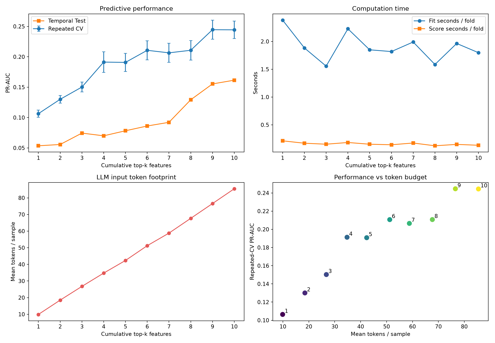

# Semiconductor Yield Fail Prediction & Quality Data Analysis

반도체 공정 평가 데이터 기반 수율 Fail 예측 및 품질 데이터 분석 프로젝트입니다. UCI Machine Learning Repository의 SECOM 데이터셋을 사용해 데이터 품질을 진단하고, Fail과 통계적으로 연관된 측정 feature 후보를 선별하며, 이후 Fail 검출 중심의 예측 모델과 품질 모니터링 방안을 설계합니다.

## 분석 목표

1. 결측·상수 feature와 클래스 불균형을 진단합니다.
2. Pass/Fail 간 차이가 큰 측정 feature 후보를 선별합니다.
3. Accuracy보다 Fail Recall, Precision, PR-AUC, Balanced Accuracy를 중심으로 모델을 평가합니다.
4. 분석 결과를 실제 원인 확정이 아닌 추가 검증이 필요한 품질 이상 후보로 해석합니다.

## 데이터

- 데이터셋: SECOM Data Set
- 출처: UCI Machine Learning Repository
- Feature URL: <https://archive.ics.uci.edu/ml/machine-learning-databases/secom/secom.data>
- Label URL: <https://archive.ics.uci.edu/ml/machine-learning-databases/secom/secom_labels.data>
- 파일: `secom.data`, `secom_labels.data`
- 원본 라벨: `-1 = Pass`, `1 = Fail`
- 분석 라벨: `is_fail = 0`은 Pass, `is_fail = 1`은 Fail

원본 파일은 저장소에 올리지 않습니다. 두 파일을 `data/raw/`에 배치한 뒤 노트북을 실행합니다.

## 프로젝트 구조

```text
.
├── data/raw/                         # 원본 데이터(버전 관리 제외)
├── notebooks/
│   ├── 00_environment_test.ipynb
│   ├── 01_data_quality_check.ipynb
│   ├── 02_eda_fail_pattern_analysis.ipynb
│   ├── 03_baseline_fail_prediction.ipynb
│   ├── 04_feature_importance_and_monitoring.ipynb
│   ├── 05_temporal_validation.ipynb
│   ├── 06_feature_budget_efficiency.ipynb
│   └── 07_feature_budget_top20_extension.ipynb
├── reports/
│   └── step1_summary.csv
├── src/
│   ├── secom_analysis.py
│   ├── modeling.py
│   ├── interpretation.py
│   ├── temporal_validation.py
│   └── feature_budget.py
├── .gitignore
├── README.md
└── requirements.txt
```

## 실행 방법

```bash
python -m venv .venv
# Windows: .venv\Scripts\activate
pip install -r requirements.txt
jupyter lab
```

노트북은 `00` → `01` → `02` → `03` → `04` → `05` → `06` → `07` 순서로 실행합니다. 데이터 품질 진단, Fail 패턴 EDA, baseline 예측, feature 근거 교차검증, 모니터링 후보 생성, 시간순 안정성 검증, feature budget 효율 분석, 상위 20개 확장 검증 순서입니다.

## Step 1. Data Quality Check Result

SECOM 반도체 공정 데이터를 대상으로 모델링 전 데이터 품질 진단을 수행했습니다.

| 항목 | 결과 |
|---|---:|
| 전체 샘플 수 | 1,567 |
| 전체 feature 수 | 590 |
| Pass 개수 | 1,463 |
| Fail 개수 | 104 |
| Fail 비율 | 6.64% |
| 결측값이 있는 feature 수 | 538 |
| 결측률 50% 이상 feature 수 | 28 |
| 상수 feature 수 | 116 |
| 제거 후보 반영 후 분석 feature 수 | 446 |

### Key Findings

1. Fail 비율은 6.64%로 심한 클래스 불균형이 존재합니다. 모든 샘플을 Pass로 예측해도 Accuracy가 93.36%이므로 Accuracy만으로 모델을 평가하면 안 됩니다.
2. 후속 모델은 Fail Recall, Precision, F1-score, PR-AUC, Balanced Accuracy와 Confusion Matrix를 함께 평가해야 합니다.
3. 590개 feature 중 538개에 일부 결측값이 있습니다. 결측률 50% 이상인 28개 feature는 측정 신뢰성이 낮은 후보로 분류합니다.
4. 값의 변화가 없는 상수 feature 116개는 Pass/Fail 구분에 기여하지 않아 제거 후보로 분류합니다.
5. 두 제거 조건의 합집합을 제외하면 후속 분석 대상은 446개 feature입니다.

### Interpretation

이 데이터는 실제 반도체 평가·품질 데이터처럼 결측값, 불균형 클래스, 고차원 feature 구조를 가집니다. 따라서 데이터 품질 진단과 전처리 기준 수립이 모델링보다 먼저 필요합니다. 후속 분석에서는 정상 샘플 예측 정확도뿐 아니라 Fail 검출률과 False Alarm의 균형을 중점적으로 평가합니다.

## Step 2. Fail Pattern EDA Result

Step 1에서 선별한 446개 feature를 대상으로 Pass/Fail 간 표준화 평균 차이와 Mann-Whitney U 검정을 계산했습니다. 446개 동시 검정에 따른 우연한 발견을 줄이기 위해 Benjamini-Hochberg 방식으로 FDR을 보정했습니다.

- 분석 feature 수: 446개
- FDR 5% 기준 유의 feature 후보: 20개
- 효과크기 상위 후보: `feature_59`, `feature_103`, `feature_129`, `feature_28`, `feature_510`
- FDR 상위 후보: `feature_59`, `feature_103`, `feature_247`, `feature_519`, `feature_510`

`feature_59`와 `feature_103`은 효과크기와 통계적 유의성 양쪽에서 모두 상위권이므로 우선 모니터링 후보입니다. 다만 이 분석은 단변량 연관성 분석이며, 결측 대체 방식·공정 시간 변화·feature 간 상관관계와 모델 기반 중요도를 함께 검증해야 합니다.

## Step 3. Baseline Fail Prediction Result

전체 데이터에서 20%를 stratified Test 세트로 분리하고, 나머지 Train 데이터에서 5-fold × 3회 반복 교차검증을 수행했습니다. 결측치 대체와 표준화는 Pipeline 안에서 각 Train fold로만 학습해 데이터 누수를 방지했습니다.

| 모델 | Train CV PR-AUC | Train CV Fail Recall | Test PR-AUC (threshold 0.5) |
|---|---:|---:|---:|
| Random Forest (balanced) | 0.198 | 0.000 | 0.200 |
| HistGradientBoosting (balanced) | 0.168 | 0.024 | 0.182 |
| Logistic Regression (balanced) | 0.163 | 0.305 | 0.118 |
| Dummy prior | 0.066 | 0.000 | 0.067 |

Train CV PR-AUC가 가장 높은 Random Forest를 선택했습니다. 하지만 기본 threshold 0.5에서는 Test Fail을 검출하지 못했으므로, Test 데이터를 보지 않고 Train out-of-fold 확률만 사용해 Fail Recall 80% 이상을 만족하는 threshold를 탐색했습니다.

### Selected operating point

| 항목 | Test 결과 |
|---|---:|
| 선택 모델 | Random Forest (balanced) |
| 선택 threshold | 0.06 |
| Fail Recall | 85.71% |
| Precision | 10.29% |
| F1-score | 18.37% |
| PR-AUC | 0.200 |
| Balanced Accuracy | 66.07% |
| True Positive | 18 |
| False Negative | 3 |
| False Positive | 157 |
| True Negative | 136 |

Fail 21건 중 18건을 검출했지만 Pass 157건을 False Alarm으로 분류했습니다. 따라서 이 operating point는 Fail 미검출을 줄이는 스크리닝 용도로는 의미가 있으나, 단독 판정 시스템으로 사용하기에는 경보 정밀도가 낮습니다. 실제 적용 시에는 후속 확인 검사, 공정 비용, 놓친 Fail의 손실을 반영해 threshold를 결정해야 합니다.

## Step 4. Feature Evidence & Monitoring Candidates

Step 3에서 선택한 Random Forest의 Train impurity importance로 상위 30개 후보를 정한 뒤, Test PR-AUC 감소 기반 permutation importance를 5회 반복 계산했습니다. 이를 Step 2의 표준화 평균 차이와 FDR 보정 통계 순위와 결합했습니다.

네 가지 근거가 모두 상위 20위 안에 포함된 우선 검토 후보는 다음과 같습니다.

| Feature | Fail 변화 방향 | 근거 수 | 해석 |
|---|---|---:|---|
| `feature_59` | 증가 | 4/4 | permutation PR-AUC 감소가 가장 큰 핵심 후보 |
| `feature_129` | 증가 | 4/4 | 모델 및 단변량 근거가 모두 일관된 후보 |
| `feature_125` | 감소 | 4/4 | Fail에서 낮아지는 방향의 공통 후보 |

그 밖에 `feature_205`, `feature_477`, `feature_130`, `feature_33`, `feature_452`, `feature_510`, `feature_103`을 복수 근거가 겹치는 모니터링 후보로 정리했습니다. 운영 데이터 가용성을 고려해 Train 결측률이 20%를 초과하는 feature는 모델 해석표에는 남기되 모니터링 후보에서는 제외했습니다.

모니터링 후보 한계는 Train Pass 분포의 median과 MAD를 사용한 탐색적 범위입니다. 실제 관리도 한계·공정 spec·출하 판정 기준이 아니며, 시간순 안정성, 장비별 분포, 측정 시스템 신뢰성과 오경보 비용을 확인한 후에만 운영 기준으로 발전시킬 수 있습니다.

## Step 5. Temporal Validation Result

timestamp 기준 앞 80%를 Train, 뒤 20%를 미래 기간 Test로 분리했습니다. 전체 기간의 Fail 비율은 시간순 첫 20% 구간에서 14.01%였으나 마지막 20%에서는 5.41%로 변해 뚜렷한 시간 drift가 확인됐습니다.

| 평가 방식 | Threshold | Fail Recall | Precision | PR-AUC | False Negative | False Positive |
|---|---:|---:|---:|---:|---:|---:|
| Temporal validation에서 선택 | 0.04 | 94.12% | 5.78% | 0.097 | 1 | 261 |
| Step 3 threshold 고정 | 0.06 | 64.71% | 6.40% | 0.097 | 6 | 161 |

시간순 threshold `0.04`는 미래 Fail 17건 중 16건을 검출했지만 Pass 297건 중 261건을 경보로 분류했습니다. 반면 Step 3의 threshold `0.06`을 그대로 적용하면 False Alarm은 감소하지만 Fail 6건을 놓쳤습니다. 또한 시간순 Test PR-AUC `0.097`은 무작위 stratified Test의 `0.200`보다 크게 낮았습니다.

따라서 현재 모델은 시간 변화에 안정적인 자동 판정 모델로 보기 어렵습니다. 포트폴리오에서는 높은 Recall만 강조하지 않고, random split과 temporal split의 차이, threshold 불안정성, drift 모니터링과 rolling backtest 필요성을 핵심 결론으로 제시합니다.

## Step 6. Top-10 Feature Budget Efficiency

원본 590개 feature 중 Step 1 품질 기준을 통과한 446개를 대상으로, Step 4 통합 근거 순위 상위 10개를 누적 적용했습니다.

| 순위 | Feature | 누적 CV PR-AUC | Temporal PR-AUC | 평균 토큰/샘플 |
|---:|---|---:|---:|---:|
| 1 | `feature_59` | 0.1064 | 0.0535 | 9.90 |
| 2 | `feature_129` | 0.1300 | 0.0557 | 18.49 |
| 3 | `feature_125` | 0.1502 | 0.0744 | 26.76 |
| 4 | `feature_205` | 0.1913 | 0.0699 | 34.75 |
| 5 | `feature_519` | 0.1908 | 0.0782 | 42.33 |
| 6 | `feature_477` | 0.2107 | 0.0861 | 51.22 |
| 7 | `feature_247` | 0.2065 | 0.0922 | 58.80 |
| 8 | `feature_130` | 0.2107 | 0.1293 | 67.67 |
| 9 | `feature_33` | **0.2446** | 0.1553 | 76.56 |
| 10 | `feature_452` | 0.2444 | **0.1615** | 85.46 |

토큰량은 feature 수에 거의 완전 선형으로 증가했습니다(R² 0.9996). CV PR-AUC도 전반적으로 상승 추세였지만(R² 0.9174), 5·7·10개 지점에서 정체 또는 소폭 하락해 엄밀한 단조 선형 관계는 아니었습니다. 학습시간(R² 0.1446)과 추론시간(R² 0.0008)은 feature 수와 선형 관계가 확인되지 않았으며, 이 작은 표에서는 tree 구조와 실행환경 변동의 영향이 더 컸습니다.

평균 CV PR-AUC 최고점과 one-standard-error rule은 모두 상위 9개를 선택했습니다. 10번째 feature를 추가하면 샘플당 토큰이 76.56에서 85.46으로 증가하고 전체 1,567개 입력에서는 119,963에서 133,908 토큰으로 늘지만 CV PR-AUC는 개선되지 않았습니다. 따라서 현재 조건의 공식 효율 optimum은 상위 9개입니다. 다만 Temporal PR-AUC는 10개에서 0.0062 높았으므로 미래 안정성을 최우선으로 할 경우 10개도 후보이며, 이 차이는 추가 rolling backtest로 확인해야 합니다.

Random Forest 자체는 LLM 토큰을 사용하지 않습니다. 위 토큰량은 선택 feature를 소수점 6자리 compact JSON으로 직렬화하고 `cl100k_base` tokenizer로 측정한 feature-value 입력량이며, system prompt 같은 고정 overhead는 제외했습니다.



## Step 7. Top-20 Extension Check

동일한 순위 기준을 20개까지 확장한 결과, **CV 성능·토큰 효율 기준 optimum 9개는 유지됐지만 선형성 결론은 유지되지 않았습니다.**

- 평균 CV PR-AUC 최고점: 9개, `0.24457`
- one-standard-error 최소 조합: 9개
- 20개 CV PR-AUC: `0.23499`
- Temporal PR-AUC 최고점: 11개, `0.21345`
- 20개 평균 토큰/샘플: `172.68`
- 9개 평균 토큰/샘플: `76.56`

1~10개 구간의 CV PR-AUC 선형 R²는 0.917이었지만 1~20 전체에서는 0.642로 낮아졌습니다. 9개 이후 성능이 포화되고 오르내리므로 feature 수와 성능의 관계를 선형으로 일반화할 수 없습니다. 반면 토큰량의 R²는 0.9997로 계속 선형 증가했습니다.

20개 조합은 9개 대비 토큰이 125.6% 많지만 CV PR-AUC는 0.0096 낮았습니다. 따라서 일반적인 CV 성능과 입력 비용 기준에서는 9개 결론이 더 강해졌습니다. 다만 11번째 `feature_510`을 포함했을 때 Temporal PR-AUC가 가장 높았으므로 시간순 운영 안정성이 목적이라면 9개와 11개를 rolling backtest로 비교해야 합니다.

이 순위는 전체 데이터를 이용한 탐색적 통계·중요도 결과에서 파생됐으므로 절대 성능은 낙관적일 수 있습니다. 실제 배포 성능 추정에서는 각 fold의 Train 데이터 안에서 feature 순위를 다시 계산하는 nested feature selection이 필요합니다.


## 해석상 주의점

SECOM feature 이름은 비식별화되어 있으므로 통계적으로 유의한 feature를 실제 물리 공정 원인으로 단정할 수 없습니다. 결과는 공정 엔지니어가 설비·공정 이력과 함께 추가 검증할 측정 인자 후보로 사용합니다.
